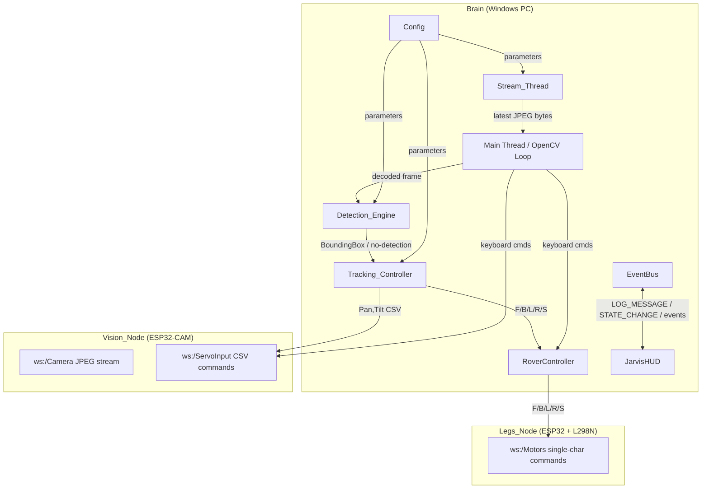

# Design Document: Jarvis Autonomous Rover

## Overview

The Jarvis Autonomous Rover system extends the existing Jarvis codebase to add real-time computer vision and autonomous control capabilities. A Windows PC ("Brain") with an NVIDIA RTX 5060 GPU ingests a live JPEG stream from an ESP32-CAM ("Vision_Node"), runs YOLOv8 person detection on the GPU, and issues WebSocket commands to autonomously steer a pan/tilt camera mount and a four-wheel drive chassis ("Legs_Node").

The system operates in two modes:
- **Manual_Mode**: keyboard-driven control via an OpenCV display window
- **Autonomous_Mode**: closed-loop tracking where the Detection_Engine and Tracking_Controller drive all servo and motor commands

All network I/O runs in background daemon threads with socket-level timeouts. Every exception is caught, logged through the existing `EventBus`, and suppressed so no background thread can crash the main process. The existing `RoverController`, `EventBus`, and `StateManager` are reused without modification.

---

## Architecture



### Key Design Decisions

1. **Single latest-frame buffer** — `Stream_Thread` writes to a `threading.Event` + shared variable protected by a `threading.Lock`. The main loop always reads the newest frame, discarding stale ones. This eliminates queue buildup and keeps latency minimal.

2. **Three independent WebSocket workers** — Camera stream, ServoInput, and Motors each run in their own daemon thread with independent reconnect loops. A failure in one does not affect the others.

3. **Tracking_Controller is a pure function layer** — offset calculation, gain application, and clamping are stateless computations. Only the resulting command dispatch touches external state, making the logic easy to test.

4. **RoverController reuse** — all motor commands from the Tracking_Controller are routed through the existing `RoverController.send_command()` to maintain consistent `RoverState` and EventBus emissions.

5. **No new threads for servo/motor send** — servo and motor sends are fire-and-forget calls from the main loop or Tracking_Controller. They are wrapped in `try/except` and log via EventBus on failure. Adding a send thread would add latency without benefit.

---

## Components and Interfaces

### `modules/vision_stream.py` — VisionStream

Owns the `Stream_Thread`. Connects to `ws://<IP>/Camera`, receives JPEG bytes, and exposes the latest frame.

```python
class VisionStream:
    def __init__(self, url: str): ...
    def start(self) -> None:          # starts daemon Stream_Thread
    def stop(self) -> None:
    def get_latest_frame(self) -> Optional[bytes]:  # returns latest JPEG bytes or None
    def is_connected(self) -> bool
```

Internal loop pseudocode:
```
while running:
    try:
        ws = websocket.WebSocket()
        ws.settimeout(2.0)
        ws.connect(url)
        while running:
            data = ws.recv()          # bytes
            with lock: _latest = data
    except Exception as e:
        bus.emit(LOG_MESSAGE, f"[VisionStream] {e}")
        time.sleep(RECONNECT_INTERVAL)
```

### `modules/servo_controller.py` — ServoController

Owns the ServoInput WebSocket connection. Exposes `send(command: str)` for CSV commands.

```python
class ServoController:
    def __init__(self, url: str): ...
    def start(self) -> None:          # starts daemon keep-alive thread
    def stop(self) -> None:
    def send(self, command: str) -> None:   # "Pan,90" / "Tilt,45" / "Light,255"
    def is_connected(self) -> bool
```

The keep-alive thread maintains the WebSocket connection with reconnect logic identical to `VisionStream`. `send()` is called from the main loop / Tracking_Controller and is protected by `try/except`.

### `modules/detection_engine.py` — DetectionEngine

Wraps YOLOv8 inference. Stateless per-frame processing.

```python
class DetectionEngine:
    def __init__(self, model_path: str): ...
    def load(self) -> None:           # loads model onto CUDA or CPU
    def detect(self, frame: np.ndarray) -> Optional[BoundingBox]:
        # runs inference, filters person class + conf >= 0.5,
        # returns largest bbox or None
```

`BoundingBox` is a simple dataclass:
```python
@dataclass
class BoundingBox:
    x: int; y: int; w: int; h: int
    confidence: float
```

### `modules/tracking_controller.py` — TrackingController

Pure control logic. Computes servo corrections and drive commands from a `BoundingBox` and frame dimensions.

```python
class TrackingController:
    def __init__(self, config: RoverConfig, rover: RoverController, servo: ServoController): ...
    def update(self, bbox: Optional[BoundingBox], frame_w: int, frame_h: int) -> None:
        # computes offsets, applies gain, clamps, sends commands
    def reset(self) -> None:          # sends S + Pan,90 + Tilt,90 on mode exit
```

Internal state: `pan_angle: float`, `tilt_angle: float`, `last_detection_time: float`.

### `modules/rover_vision_app.py` — RoverVisionApp

The OpenCV main loop. Owns mode state, keyboard handling, and orchestrates all components.

```python
class RoverVisionApp:
    def __init__(self, config: RoverConfig): ...
    def run(self) -> None:            # blocking OpenCV loop — call from a thread or directly
    def stop(self) -> None:
```

### `config.py` — Extended Config

New `RoverConfig` dataclass added to `config.py`:

```python
@dataclass
class RoverConfig:
    # Network
    vision_stream_url: str      # ws://<IP>/Camera
    servo_url: str              # ws://<IP>/ServoInput
    motor_url: str              # ws://<IP>/Motors

    # Tracking
    dead_zone_px: int           # default 30
    pan_tilt_gain: float        # default 0.05
    servo_step: int             # default 5 (manual key step)

    # Drive thresholds
    bbox_min_fraction: float    # default 0.10
    bbox_max_fraction: float    # default 0.30

    # Timeouts
    no_detection_timeout: float # default 2.0 seconds
    ws_recv_timeout: float      # default 2.0 seconds
    reconnect_interval: float   # default 3.0 seconds

    # YOLO
    yolo_model: str             # default "yolov8n.pt"
    yolo_confidence: float      # default 0.5
```

---

## Data Models

### BoundingBox

```python
@dataclass
class BoundingBox:
    x: int          # top-left x pixel
    y: int          # top-left y pixel
    w: int          # width in pixels
    h: int          # height in pixels
    confidence: float

    @property
    def area(self) -> int:
        return self.w * self.h

    @property
    def center_x(self) -> float:
        return self.x + self.w / 2

    @property
    def center_y(self) -> float:
        return self.y + self.h / 2
```

### RoverMode

```python
from enum import Enum

class RoverMode(Enum):
    MANUAL = "MANUAL"
    AUTONOMOUS = "AUTONOMOUS"
```

### TrackingState (internal to TrackingController)

```python
@dataclass
class TrackingState:
    pan_angle: float = 90.0
    tilt_angle: float = 90.0
    last_detection_time: float = 0.0
```

### New SystemEvents

Added to `core/event_bus.py`:

```python
class SystemEvents:
    # ... existing events ...
    ROVER_MODE_CHANGE   = "ROVER_MODE_CHANGE"    # payload: "MANUAL" | "AUTONOMOUS"
    ROVER_NO_DETECTION  = "ROVER_NO_DETECTION"   # payload: None
    ROVER_DETECTION     = "ROVER_DETECTION"      # payload: BoundingBox
```

---

## Correctness Properties

*A property is a characteristic or behavior that should hold true across all valid executions of a system — essentially, a formal statement about what the system should do. Properties serve as the bridge between human-readable specifications and machine-verifiable correctness guarantees.*

### Property 1: WebSocket send exceptions are always logged and suppressed

*For any* exception type raised during a WebSocket send operation, the exception SHALL be caught, a LOG_MESSAGE event SHALL be emitted via the EventBus containing the subsystem name and exception message, and the exception SHALL NOT propagate to the calling thread.

**Validates: Requirements 1.6, 11.1, 11.3**

---

### Property 2: Stream_Thread retains only the latest frame

*For any* sequence of N JPEG byte payloads received by the Stream_Thread, after all N payloads have been processed, `get_latest_frame()` SHALL return only the last payload in the sequence.

**Validates: Requirements 2.2**

---

### Property 3: Stream_Thread exceptions are logged and reconnection is attempted

*For any* exception raised during a WebSocket receive operation in the Stream_Thread, the exception SHALL be caught, a LOG_MESSAGE event SHALL be emitted, and the thread SHALL remain alive and attempt reconnection.

**Validates: Requirements 2.4, 11.4**

---

### Property 4: Invalid JPEG payloads preserve the last good frame

*For any* invalid byte sequence passed to the frame decoder, the decoder SHALL return the previously decoded frame unchanged, and no exception SHALL propagate.

**Validates: Requirements 3.4**

---

### Property 5: Autonomous mode suppresses all keyboard drive and servo commands

*For any* keyboard drive key (W/A/S/D/Space) or pan/tilt arrow key pressed while `RoverMode` is `AUTONOMOUS`, no motor command and no servo command SHALL be dispatched to the respective WebSocket endpoints.

**Validates: Requirements 4.7, 5.6**

---

### Property 6: Servo angle clamping is always enforced

*For any* computed pan or tilt angle value (including values below 0 or above 180), the value sent to the Servo_Controller SHALL be clamped to the inclusive range [0, 180].

**Validates: Requirements 5.5, 7.5**

---

### Property 7: Detection filter retains only high-confidence person detections

*For any* list of raw YOLO inference results containing detections of arbitrary classes and confidence scores, the filtered output SHALL contain only detections where class label is "person" AND confidence >= 0.5.

**Validates: Requirements 6.3**

---

### Property 8: Largest bounding box is always selected as primary target

*For any* non-empty list of filtered person detections, the detection returned by the DetectionEngine SHALL be the one with the maximum bounding box area (w × h).

**Validates: Requirements 6.4**

---

### Property 9: Tracking offset computation is correct

*For any* BoundingBox and frame dimensions (frame_w, frame_h), the computed horizontal offset SHALL equal `bbox.center_x - frame_w / 2` and the vertical offset SHALL equal `bbox.center_y - frame_h / 2`.

**Validates: Requirements 7.1**

---

### Property 10: Dead zone suppresses servo commands; outside dead zone triggers correction

*For any* offset within the Dead_Zone threshold, no servo command SHALL be sent. *For any* offset exceeding the Dead_Zone threshold, a servo command SHALL be sent in the direction that reduces the offset.

**Validates: Requirements 7.2, 7.3, 7.4**

---

### Property 11: Drive command matches bbox area fraction relative to thresholds

*For any* BoundingBox and frame dimensions, the drive command sent to the RoverController SHALL be:
- 'F' when `bbox.area / (frame_w * frame_h) < bbox_min_fraction`
- 'B' when `bbox.area / (frame_w * frame_h) > bbox_max_fraction`
- 'S' when the fraction is between the two thresholds (inclusive)

**Validates: Requirements 8.1, 8.2, 8.3, 8.4**

---

### Property 12: Mode change always emits an EventBus event

*For any* transition between `RoverMode.MANUAL` and `RoverMode.AUTONOMOUS`, a `ROVER_MODE_CHANGE` event SHALL be emitted via the EventBus with the new mode as the payload.

**Validates: Requirements 9.5**

---

### Property 13: Background thread exceptions never reach the main thread

*For any* exception raised inside any background daemon thread (Stream_Thread, ServoController keep-alive, Motor keep-alive), the exception SHALL be caught within that thread, logged via EventBus, and SHALL NOT propagate to the main thread.

**Validates: Requirements 11.4**

---

## Error Handling

| Failure Scenario | Handler Location | Action |
|---|---|---|
| Camera WebSocket connect fails | `VisionStream._loop()` | Log via EventBus, sleep `reconnect_interval`, retry |
| Camera WebSocket recv raises | `VisionStream._loop()` | Log via EventBus, break inner loop, reconnect |
| ServoController send raises | `ServoController.send()` | Log via EventBus, suppress |
| Motor WebSocket send raises | `RoverController` / motor send wrapper | Log via EventBus, suppress |
| JPEG decode fails (`cv2.imdecode` returns None) | `RoverVisionApp._decode_frame()` | Discard payload, return last good frame |
| YOLO inference raises | `DetectionEngine.detect()` | Log via EventBus, return None (no detection) |
| Tracking_Controller update raises | `RoverVisionApp` main loop | Log via EventBus, continue loop |
| Mode transition raises | `RoverVisionApp._toggle_mode()` | Log via EventBus, revert mode |

All background threads use the pattern:
```python
while self._running:
    try:
        # ... connect and operate ...
    except Exception as e:
        bus.emit(SystemEvents.LOG_MESSAGE, f"[{SUBSYSTEM}] {e}")
        time.sleep(self._config.reconnect_interval)
```

No `threading.Thread` is allowed to propagate an unhandled exception. All thread `run()` methods are wrapped in a top-level `try/except Exception`.

---

## Testing Strategy

### Dual Testing Approach

Unit tests cover specific examples, edge cases, and error conditions. Property-based tests verify universal invariants across randomized inputs. Both are required for comprehensive coverage.

### Property-Based Testing Library

**`hypothesis`** (Python) — mature, well-documented, integrates with `pytest`. Each property test runs a minimum of 100 iterations (`@settings(max_examples=100)`).

Tag format for each property test:
```
# Feature: jarvis-autonomous-rover, Property <N>: <property_text>
```

### Property Tests

| Property | Module Under Test | Key Generators |
|---|---|---|
| P1: WS send exceptions logged & suppressed | `ServoController.send`, motor send wrapper | `st.from_type(Exception)` subclasses |
| P2: Latest frame only | `VisionStream.get_latest_frame` | `st.lists(st.binary(), min_size=1)` |
| P3: Stream recv exceptions logged, thread alive | `VisionStream._loop` | `st.from_type(Exception)` subclasses |
| P4: Invalid JPEG preserves last good frame | `RoverVisionApp._decode_frame` | `st.binary()` (arbitrary bytes) |
| P5: Autonomous mode suppresses keyboard commands | `RoverVisionApp._handle_key` | `st.sampled_from(DRIVE_KEYS + SERVO_KEYS)` |
| P6: Servo angle clamping | `TrackingController._clamp_angle` | `st.floats(min_value=-1000, max_value=1000)` |
| P7: Detection filter | `DetectionEngine._filter_detections` | `st.lists(detection_strategy())` |
| P8: Largest bbox selected | `DetectionEngine._select_primary` | `st.lists(bbox_strategy(), min_size=1)` |
| P9: Offset computation | `TrackingController._compute_offsets` | `st.integers`, `st.integers` for frame dims |
| P10: Dead zone behavior | `TrackingController.update` | `st.floats` for offsets, `st.integers` for dead_zone |
| P11: Drive command from fraction | `TrackingController._drive_command` | `st.floats(0, 1)` for fraction |
| P12: Mode change emits event | `RoverVisionApp._toggle_mode` | `st.sampled_from(RoverMode)` |
| P13: Background thread exception isolation | All thread `run()` methods | `st.from_type(Exception)` subclasses |

### Unit / Example Tests

- Key mapping: W→F, S→B, A→L, D→R, Space→S, release→S (one test per key)
- Mode toggle: Manual→Autonomous, Autonomous→Manual
- Mode exit side-effects: S command sent, Pan,90 + Tilt,90 sent
- No-detection timeout: simulate elapsed time > timeout, verify S sent
- CUDA/CPU device selection: mock `torch.cuda.is_available()`
- No-detection EventBus event emitted when detect() returns None
- Config attribute presence and valid value ranges

### Integration Tests

- Reconnect within 5 seconds after simulated disconnect (mock WebSocket)
- Other subsystems continue when one WebSocket is unavailable
- Frame availability latency < 50ms under mock stream

### Test File Layout

```
tests/
  test_vision_stream.py        # P2, P3, integration reconnect
  test_servo_controller.py     # P1 (servo side)
  test_detection_engine.py     # P7, P8, unit examples
  test_tracking_controller.py  # P6, P9, P10, P11, unit examples
  test_rover_vision_app.py     # P4, P5, P12, P13, unit examples
  test_config.py               # smoke: config attribute presence
```
